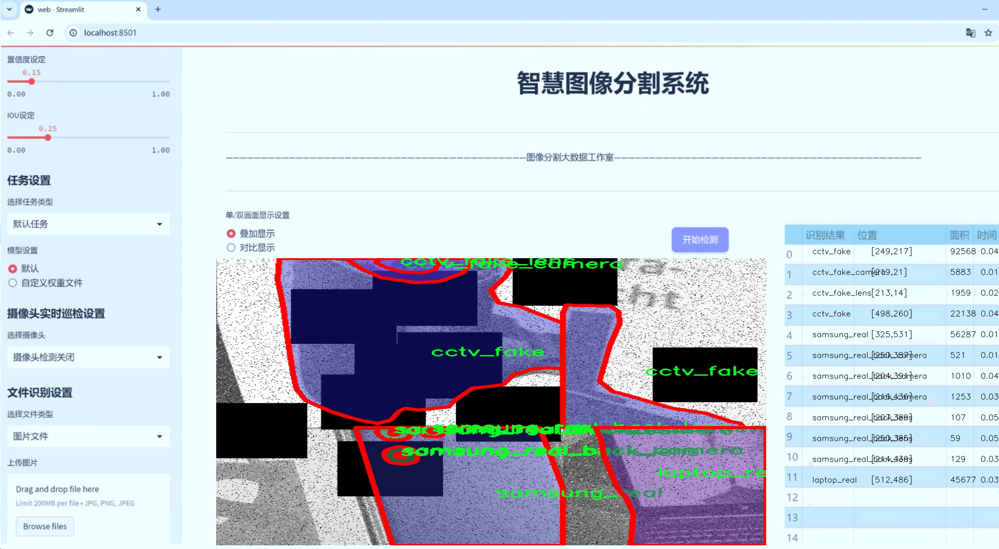
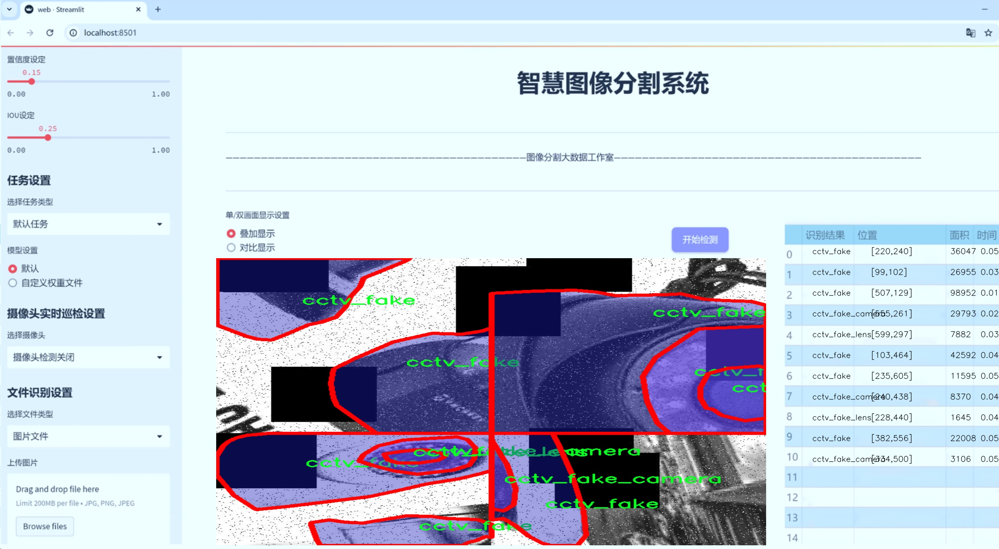
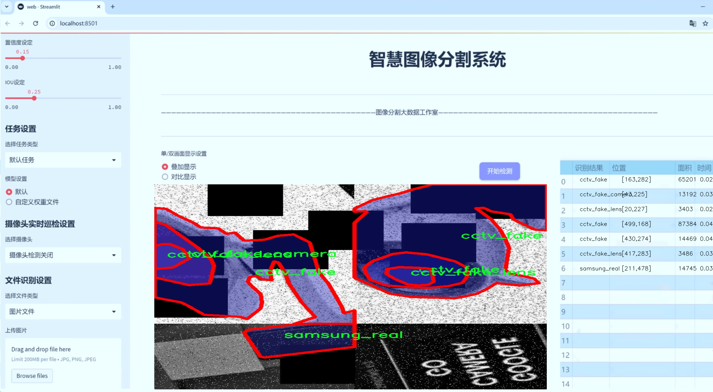
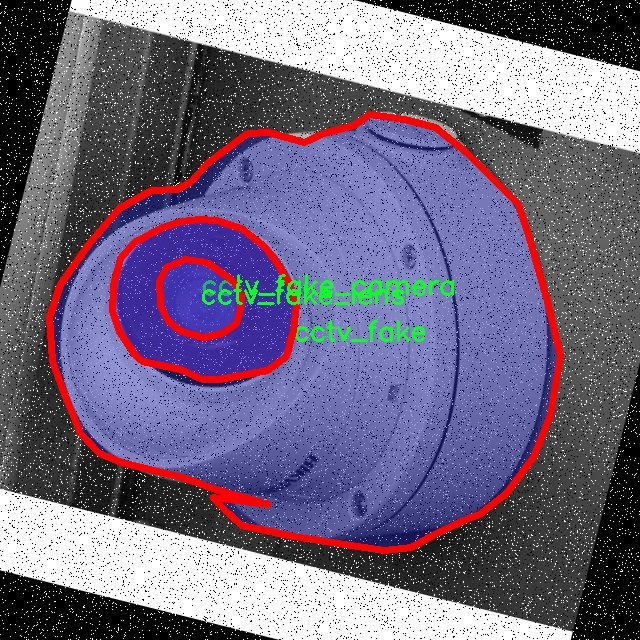
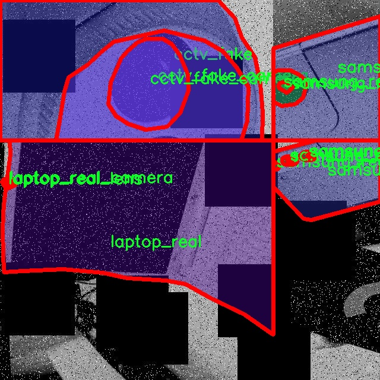
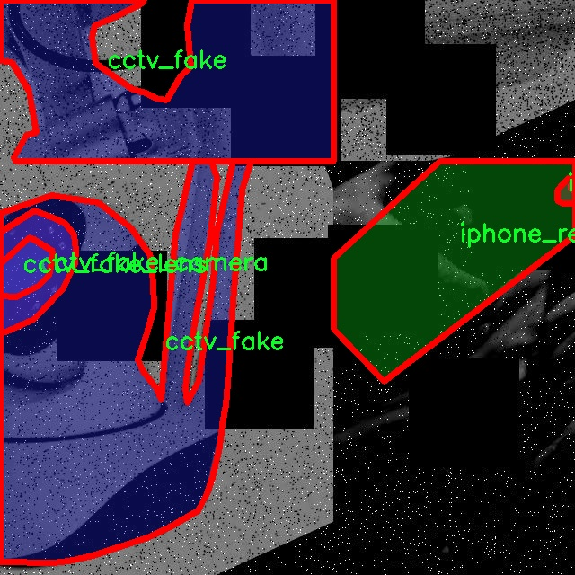
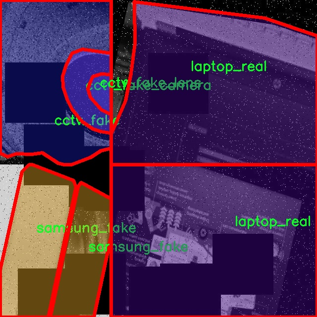
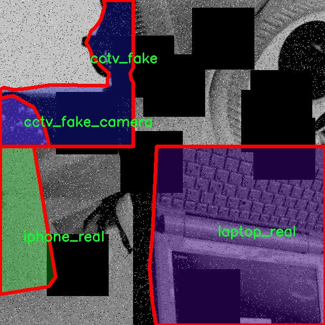

# 电子摄像头分割系统源码＆数据集分享
 [yolov8-seg-C2f-DWR＆yolov8-seg-C2f-ContextGuided等50+全套改进创新点发刊_一键训练教程_Web前端展示]

### 1.研究背景与意义

项目参考[ILSVRC ImageNet Large Scale Visual Recognition Challenge](https://gitee.com/YOLOv8_YOLOv11_Segmentation_Studio/projects)

项目来源[AAAI Global Al lnnovation Contest](https://kdocs.cn/l/cszuIiCKVNis)

研究背景与意义

随着人工智能技术的迅猛发展，计算机视觉在各个领域的应用日益广泛，尤其是在安全监控、智能家居和工业自动化等场景中，电子摄像头的智能化程度显著提升。电子摄像头不仅是监控和记录的工具，更是数据分析和决策支持的重要组成部分。在这一背景下，基于深度学习的目标检测与分割技术，尤其是YOLO（You Only Look Once）系列模型，因其高效性和实时性，成为了研究的热点。

YOLOv8作为YOLO系列的最新版本，具备了更强的特征提取能力和更快的推理速度，能够在复杂环境中实现高精度的目标检测与分割。然而，传统的YOLOv8模型在处理多类别、多样本的复杂场景时，仍然面临着一定的挑战，尤其是在细粒度分割和实例区分方面。因此，针对YOLOv8进行改进，构建一个更为精确的电子摄像头分割系统，具有重要的理论价值和实际意义。

本研究将利用一个包含6200张图像、32个类别的多样化数据集，涵盖了不同品牌和类型的电子摄像头及其配件，如CCTV、iPhone和Samsung等。这些数据不仅丰富了模型的训练样本，也为其在实际应用中的泛化能力提供了保障。通过对这些图像进行实例分割，能够有效地识别和区分不同类型的摄像头及其部件，为后续的监控系统优化提供了数据支持。

在安全监控领域，准确的目标检测与分割能够显著提升系统的智能化水平，帮助用户更好地识别潜在的安全隐患和异常行为。同时，随着智能家居的普及，电子摄像头作为家庭安全的第一道防线，其智能化程度直接影响到用户的生活质量和安全感。因此，基于改进YOLOv8的电子摄像头分割系统的研究，不仅能够推动计算机视觉技术的发展，还能为实际应用提供切实可行的解决方案。

此外，研究成果还可以为其他领域的图像处理提供借鉴。例如，在工业自动化中，精确的设备识别与状态监测可以提高生产效率和安全性；在医疗影像分析中，细粒度的图像分割能够辅助医生进行更为准确的诊断。因此，本研究的意义不仅限于电子摄像头的应用，更为广泛的计算机视觉领域提供了重要的参考。

综上所述，基于改进YOLOv8的电子摄像头分割系统的研究，具有重要的理论价值和广泛的应用前景。通过深入探索该领域的技术细节与应用场景，我们期待能够为未来的智能监控系统和相关技术的发展提供新的思路和方法。

### 2.图片演示







##### 注意：由于此博客编辑较早，上面“2.图片演示”和“3.视频演示”展示的系统图片或者视频可能为老版本，新版本在老版本的基础上升级如下：（实际效果以升级的新版本为准）

  （1）适配了YOLOV8的“目标检测”模型和“实例分割”模型，通过加载相应的权重（.pt）文件即可自适应加载模型。

  （2）支持“图片识别”、“视频识别”、“摄像头实时识别”三种识别模式。

  （3）支持“图片识别”、“视频识别”、“摄像头实时识别”三种识别结果保存导出，解决手动导出（容易卡顿出现爆内存）存在的问题，识别完自动保存结果并导出到tempDir中。

  （4）支持Web前端系统中的标题、背景图等自定义修改，后面提供修改教程。

  另外本项目提供训练的数据集和训练教程,暂不提供权重文件（best.pt）,需要您按照教程进行训练后实现图片演示和Web前端界面演示的效果。

### 3.视频演示

[3.1 视频演示](https://www.bilibili.com/video/BV1q62JYgELF/)

### 4.数据集信息展示

##### 4.1 本项目数据集详细数据（类别数＆类别名）

nc: 32
names: ['cctv_fake', 'cctv_fake_camera', 'cctv_fake_lens', 'cctv_real', 'cctv_real_camera', 'cctv_real_lens', 'iphone_fake', 'iphone_fake_back_camera', 'iphone_fake_back_lens', 'iphone_fake_front_camera', 'iphone_fake_front_lens', 'iphone_real', 'iphone_real_back_camera', 'iphone_real_back_lens', 'iphone_real_front_camera', 'iphone_real_front_lens', 'laptop_fake', 'laptop_fake_camera', 'laptop_fake_lens', 'laptop_real', 'laptop_real_camera', 'laptop_real_lens', 'samsung_fake', 'samsung_fake_back_camera', 'samsung_fake_back_lens', 'samsung_fake_front_camera', 'samsung_fake_front_lens', 'samsung_real', 'samsung_real_back_camera', 'samsung_real_back_lens', 'samsung_real_front_camera', 'samsung_real_front_lens']


##### 4.2 本项目数据集信息介绍

数据集信息展示

在本研究中，我们使用了名为“Batch-1”的数据集，以训练和改进YOLOv8-seg的电子摄像头分割系统。该数据集包含32个类别，涵盖了多种电子设备及其配件，旨在为计算机视觉模型提供丰富的训练样本，从而提升其在实际应用中的准确性和鲁棒性。

“Batch-1”数据集的类别设计充分考虑了现代电子设备的多样性和复杂性，具体包括了假冒和真实的监控摄像头、智能手机及其镜头、笔记本电脑等。这些类别不仅反映了市场上常见的电子产品类型，还为模型的训练提供了广泛的场景变换和物体特征。数据集中包括的类别如下：假冒监控摄像头（cctv_fake）、假冒监控摄像头镜头（cctv_fake_lens）、真实监控摄像头（cctv_real）、真实监控摄像头镜头（cctv_real_lens）、假冒和真实的iPhone及其前后镜头（iphone_fake、iphone_real、iphone_fake_back_camera、iphone_real_back_camera、iphone_fake_front_camera、iphone_real_front_camera、iphone_fake_back_lens、iphone_real_back_lens、iphone_fake_front_lens、iphone_real_front_lens）、假冒和真实的笔记本电脑及其镜头（laptop_fake、laptop_real、laptop_fake_camera、laptop_real_camera、laptop_fake_lens、laptop_real_lens）、假冒和真实的三星手机及其镜头（samsung_fake、samsung_real、samsung_fake_back_camera、samsung_real_back_camera、samsung_fake_front_camera、samsung_real_front_camera、samsung_fake_back_lens、samsung_real_back_lens、samsung_fake_front_lens、samsung_real_front_lens）。

通过这种多样化的类别设置，数据集不仅可以帮助模型识别不同品牌和类型的电子设备，还能增强其对假冒产品的识别能力，这在当今市场上显得尤为重要。随着电子产品的迅速更新换代，假冒产品的种类和外观也在不断变化，因此，数据集中的样本需要具备一定的代表性和多样性，以便模型能够学习到有效的特征。

在数据集的构建过程中，确保样本的质量和标注的准确性是至关重要的。每个类别的样本均经过严格筛选和标注，以保证训练数据的可靠性。此外，数据集还考虑到了不同光照条件、拍摄角度和背景环境等因素，使得模型在实际应用中能够更好地适应各种复杂场景。

总之，“Batch-1”数据集为YOLOv8-seg的电子摄像头分割系统提供了一个坚实的基础，涵盖了丰富的类别和多样的样本特征。通过对该数据集的有效利用，我们期望能够显著提升模型在电子设备识别和分割任务中的性能，为相关领域的研究和应用提供有力支持。随着数据集的不断扩展和更新，我们相信这一系统将在未来的智能监控、安防和电子产品识别等领域发挥重要作用。











### 5.全套项目环境部署视频教程（零基础手把手教学）

[5.1 环境部署教程链接（零基础手把手教学）](https://www.bilibili.com/video/BV1jG4Ve4E9t/?vd_source=bc9aec86d164b67a7004b996143742dc)


[5.2 安装Python虚拟环境创建和依赖库安装视频教程链接（零基础手把手教学）](https://www.bilibili.com/video/BV1nA4VeYEze/?vd_source=bc9aec86d164b67a7004b996143742dc)

### 6.手把手YOLOV8-seg训练视频教程（零基础小白有手就能学会）

[6.1 手把手YOLOV8-seg训练视频教程（零基础小白有手就能学会）](https://www.bilibili.com/video/BV1cA4VeYETe/?vd_source=bc9aec86d164b67a7004b996143742dc)


按照上面的训练视频教程链接加载项目提供的数据集，运行train.py即可开始训练



     Epoch   gpu_mem       box       obj       cls    labels  img_size
     1/200     0G   0.01576   0.01955  0.007536        22      1280: 100%|██████████| 849/849 [14:42<00:00,  1.04s/it]
               Class     Images     Labels          P          R     mAP@.5 mAP@.5:.95: 100%|██████████| 213/213 [01:14<00:00,  2.87it/s]
                 all       3395      17314      0.994      0.957      0.0957      0.0843

     Epoch   gpu_mem       box       obj       cls    labels  img_size
     2/200     0G   0.01578   0.01923  0.007006        22      1280: 100%|██████████| 849/849 [14:44<00:00,  1.04s/it]
               Class     Images     Labels          P          R     mAP@.5 mAP@.5:.95: 100%|██████████| 213/213 [01:12<00:00,  2.95it/s]
                 all       3395      17314      0.996      0.956      0.0957      0.0845

     Epoch   gpu_mem       box       obj       cls    labels  img_size
     3/200     0G   0.01561    0.0191  0.006895        27      1280: 100%|██████████| 849/849 [10:56<00:00,  1.29it/s]
               Class     Images     Labels          P          R     mAP@.5 mAP@.5:.95: 100%|███████   | 187/213 [00:52<00:00,  4.04it/s]
                 all       3395      17314      0.996      0.957      0.0957      0.0845


### 7.50+种全套YOLOV8-seg创新点代码加载调参视频教程（一键加载写好的改进模型的配置文件）

[7.1 50+种全套YOLOV8-seg创新点代码加载调参视频教程（一键加载写好的改进模型的配置文件）](https://www.bilibili.com/video/BV1Hw4VePEXv/?vd_source=bc9aec86d164b67a7004b996143742dc)

### 8.YOLOV8-seg图像分割算法原理

原始YOLOv8-seg算法原理

YOLOv8-seg是YOLO系列中的最新进展，结合了目标检测与图像分割的功能，标志着计算机视觉领域的一次重要技术飞跃。与前代YOLOv5相比，YOLOv8在检测精度和速度上都有显著提升，尤其是在复杂场景下的表现更为优异。YOLOv8的设计理念围绕着高效、灵活和易用，旨在满足多种应用需求，如实时监控、自动驾驶和医疗影像分析等。

YOLOv8的网络结构主要分为四个部分：输入端、骨干网络、颈部网络和头部网络。输入端的设计采用了马赛克数据增强技术，这一技术通过将多张图像随机拼接，生成新的训练样本，迫使模型学习到更丰富的特征和背景信息，从而提高了模型的泛化能力。此外，YOLOv8还引入了自适应锚框计算和自适应灰度填充，这些创新措施使得模型在处理不同长宽比的图像时，能够有效减少信息冗余，提高目标检测和推理的速度。

在骨干网络部分，YOLOv8采用了C2f模块和空间金字塔池化（SPPF）结构。C2f模块通过丰富的分支和跨层连接，增强了梯度流动，使得模型能够更好地学习到残差特征。与YOLOv5的C3模块相比，C2f模块在保持轻量化的同时，提供了更强的特征表示能力。这种设计使得YOLOv8在提取图像特征时，能够更加全面和准确，尤其是在处理复杂背景和多尺度目标时，表现尤为突出。

颈部网络采用了路径聚合网络（PAN）结构，旨在加强不同尺度对象的特征融合能力。通过将来自骨干网络不同阶段的特征图进行融合，YOLOv8能够更好地捕捉到不同尺度目标的信息。这种多尺度特征融合的策略，不仅提高了目标检测的性能，还增强了模型的鲁棒性，使其在面对各种复杂场景时，依然能够保持较高的检测精度。

头部网络是YOLOv8的核心部分，负责最终的目标检测和分类任务。与以往的耦合头结构不同，YOLOv8采用了解耦头结构，将分类和检测过程分开处理。这一设计使得模型在处理目标检测时，能够更加高效和精准。具体而言，头部网络包含三个检测头，分别用于不同尺寸信息下的目标检测。每个检测头通过一系列卷积层和反卷积层生成检测结果，进一步提升了模型的检测能力。

在损失计算方面，YOLOv8引入了Task-Aligned Assigner分配策略，根据分类与回归的分数加权结果选择正样本。分类分支采用了二元交叉熵损失（BCELoss），而回归分支则结合了分布焦点损失（DFLoss）和完全交并比损失函数（CIOULoss），以提升模型对边界框预测的精准性。这种损失函数的设计，使得YOLOv8在训练过程中能够快速聚焦于标签附近的数值，从而提高了模型的整体性能。

值得一提的是，YOLOv8在头部网络中抛弃了传统的基于锚框的检测方法，转而采用无锚框检测头。这一转变不仅简化了模型结构，还提高了模型的灵活性。无锚框方法将目标检测转化为关键点检测，避免了预设锚框的复杂性，使得模型在处理不同数据集时，能够更好地适应变化。这种创新的设计使得YOLOv8在处理形状各异、尺度不一的目标时，展现出更强的适应能力和准确性。

总的来说，YOLOv8-seg算法通过一系列创新的设计和改进，不仅提升了目标检测的精度和速度，还扩展了其在图像分割任务中的应用潜力。其高效的网络结构和灵活的损失计算策略，使得YOLOv8在各种复杂场景下都能保持优异的表现，成为计算机视觉领域的重要工具。随着YOLOv8的不断发展和应用，未来在自动驾驶、安防监控、医疗影像等领域的潜力将更加广阔，推动相关技术的进一步进步。


### 9.系统功能展示（检测对象为举例，实际内容以本项目数据集为准）

图9.1.系统支持检测结果表格显示

  图9.2.系统支持置信度和IOU阈值手动调节

  图9.3.系统支持自定义加载权重文件best.pt(需要你通过步骤5中训练获得)

  图9.4.系统支持摄像头实时识别

  图9.5.系统支持图片识别

  图9.6.系统支持视频识别

  图9.7.系统支持识别结果文件自动保存

  图9.8.系统支持Excel导出检测结果数据


### 10.50+种全套YOLOV8-seg创新点原理讲解（非科班也可以轻松写刊发刊，V11版本正在科研待更新）

#### 10.1 由于篇幅限制，每个创新点的具体原理讲解就不一一展开，具体见下列网址中的创新点对应子项目的技术原理博客网址【Blog】：


[10.1 50+种全套YOLOV8-seg创新点原理讲解链接](https://gitee.com/qunmasj/good)

#### 10.2 部分改进模块原理讲解(完整的改进原理见上图和技术博客链接)【此小节的图要是加载失败请移步原始博客查看，链接：https://blog.csdn.net/cheng2333333?type=blog】
### YOLOv8简介
#### Yolov8网络模型
Yolov8n的网络分为输入端、主干网( Back-bone) 、Neck模块和输出端4个部分（图4)。输
人端主要有马赛克( Mosaic）数据增强、自适应锚框计算和自适应灰度填充。主干网有Conv、C2和SPPF结构，其中，C2r模块是对残差特征进行学习的主要模块，该模块仿照Yolov7的ELAN结构,通过更多的分支跨层连接，丰富了模型的梯度流，可形成一个具有更强特征表示能力的神经网络模
块。Neck模块采用PAN ( path aggregation nelwOrk ,结构，可加强网络对不同缩放尺度对象特征融合的
能力。输出端将分类和检测过程进行解耦，主要包括损失计算和目标检测框筛选，其中，损失计算过程主要包括正负样本分配策略和 Loss计算，Yolov8n 网络主要使用TaskAlignedAssignerl 10]方法，即根据分类与回归的分数加权结果选择正样本;Loss计算包括分类和回归2个分支，无Ob-jecIness分支。分类分支依然采用BCE Loss，回归分支则使用了Distribution Focal Loss!11〕和CIOU( complele inlersection over union)损失函数。

### 可扩张残差（DWR）注意力模块
当前的许多工作直接采用多速率深度扩张卷积从一个输入特征图中同时捕获多尺度上下文信息，从而提高实时语义分割的特征提取效率。 然而，这种设计可能会因为结构和超参数的不合理而导致多尺度上下文信息的访问困难。 为了降低绘制多尺度上下文信息的难度，我们提出了一种高效的多尺度特征提取方法，该方法分解了原始的单步特征提取方法方法分为两个步骤，区域残差-语义残差。 在该方法中，多速率深度扩张卷积在特征提取中发挥更简单的作用：根据第一步提供的每个简明区域形式特征图，在第二步中使用一个所需的感受野执行简单的基于语义的形态过滤 一步，提高他们的效率。 此外，扩张率和扩张卷积的容量每个网络阶段都经过精心设计，以充分利用所有可以实现的区域形式的特征图。 因此，我们分别为高层和低层网络设计了一种新颖的扩张式残差（DWR）模块和简单倒置残差（SIR）模块。


首先，该博客引入了一个Dilation-wise Residual（DWR）模块，用于提取网络高层的特征，如图2a所示。多分支结构用于扩展感受野，其中每个分支采用不同空洞率的空洞深度卷积。
然后，专门设计了一个Simple Inverted Residual（SIR）模块来提取网络低层的特征，如图2b所示。该模块仅具有3×3的微小感受野，但使用inverted bottleneck式结构来扩展通道数量，确保更强的特征提取能力。
最后，基于DWR和SIR模块，构建了一个编码器-解码器风格的网络DWRSeg，其中解码器采用了简单的类似FCN的结构。解码器使用来自最后两个阶段的强语义信息直接对特征图进行上采样，然后将它们与来自较低阶段的特征图（包含丰富的详细信息）拼接起来，以进行最终预测。


### 11.项目核心源码讲解（再也不用担心看不懂代码逻辑）

#### 11.1 ui.py

以下是经过简化和注释的核心代码部分：

```python
import sys
import subprocess

def run_script(script_path):
    """
    使用当前 Python 环境运行指定的脚本。

    Args:
        script_path (str): 要运行的脚本路径
    """
    # 获取当前 Python 解释器的路径
    python_path = sys.executable

    # 构建运行命令，使用 streamlit 运行指定的脚本
    command = f'"{python_path}" -m streamlit run "{script_path}"'

    # 执行命令，并捕获结果
    result = subprocess.run(command, shell=True)
    
    # 检查脚本运行是否成功
    if result.returncode != 0:
        print("脚本运行出错。")

# 主程序入口
if __name__ == "__main__":
    # 指定要运行的脚本路径
    script_path = "web.py"  # 假设脚本在当前目录下

    # 调用函数运行脚本
    run_script(script_path)
```

### 代码分析与注释：
1. **导入模块**：
   - `sys`：用于访问与 Python 解释器相关的变量和函数。
   - `subprocess`：用于创建新进程、连接到它们的输入/输出/错误管道，并获取返回码。

2. **`run_script` 函数**：
   - 功能：接受一个脚本路径作为参数，并在当前 Python 环境中运行该脚本。
   - `python_path = sys.executable`：获取当前 Python 解释器的路径，以确保使用正确的 Python 环境。
   - `command`：构建一个命令字符串，用于在 shell 中运行 `streamlit` 以启动指定的脚本。
   - `subprocess.run(command, shell=True)`：执行构建的命令，`shell=True` 允许使用 shell 语法。
   - `result.returncode`：检查命令的返回码，非零值表示执行出错。

3. **主程序入口**：
   - `if __name__ == "__main__":`：确保只有在直接运行该脚本时才会执行以下代码。
   - `script_path = "web.py"`：指定要运行的脚本路径（假设在当前目录）。
   - `run_script(script_path)`：调用 `run_script` 函数以执行指定的脚本。 

这样，代码的核心功能和逻辑得以保留，同时通过注释使其更易于理解。

这个文件名为 `ui.py`，它的主要功能是运行一个指定的 Python 脚本，具体来说是通过 Streamlit 框架来启动一个 Web 应用。代码的结构相对简单，主要由几个部分组成。

首先，文件导入了一些必要的模块，包括 `sys`、`os` 和 `subprocess`。其中，`sys` 模块用于访问与 Python 解释器相关的变量和函数，`os` 模块提供了与操作系统交互的功能，而 `subprocess` 模块则用于创建新进程、连接到它们的输入/输出/错误管道，并获取它们的返回码。

接下来，文件中定义了一个名为 `run_script` 的函数。这个函数接受一个参数 `script_path`，它是要运行的脚本的路径。函数内部首先获取当前 Python 解释器的路径，使用 `sys.executable` 可以得到这一信息。然后，构建一个命令字符串，这个命令使用当前的 Python 解释器来运行指定的脚本，具体是通过 `streamlit run` 命令来启动 Streamlit 应用。

在构建完命令后，使用 `subprocess.run` 来执行这个命令。这里的 `shell=True` 参数允许在 shell 中执行命令。执行完命令后，函数检查返回码，如果返回码不为零，表示脚本运行过程中出现了错误，此时会打印出“脚本运行出错”的提示信息。

最后，在文件的主程序部分，使用 `if __name__ == "__main__":` 来确保只有在直接运行该文件时才会执行后面的代码。这里指定了要运行的脚本路径，调用了 `abs_path` 函数来获取 `web.py` 的绝对路径。然后，调用 `run_script` 函数来执行这个脚本。

总体来说，这个 `ui.py` 文件的功能是通过 Streamlit 框架来启动一个 Web 应用，具体的应用逻辑则在 `web.py` 文件中实现。通过这种方式，用户可以方便地运行和调试 Streamlit 应用。

#### 11.2 ultralytics\nn\extra_modules\orepa.py

以下是经过简化和注释的核心代码部分，主要保留了 `OREPA` 类及其相关功能：

```python
import torch
import torch.nn as nn
import torch.nn.init as init
import torch.nn.functional as F
import numpy as np

# 定义 OREPA 类
class OREPA(nn.Module):
    def __init__(self, in_channels, out_channels, kernel_size=3, stride=1, padding=None, groups=1, dilation=1, act=True):
        super(OREPA, self).__init__()
        
        # 激活函数的选择
        self.nonlinear = nn.ReLU() if act else nn.Identity()
        
        # 保存输入输出通道数、卷积核大小等参数
        self.in_channels = in_channels
        self.out_channels = out_channels
        self.kernel_size = kernel_size
        self.stride = stride
        self.padding = padding if padding is not None else (kernel_size // 2)
        self.groups = groups
        self.dilation = dilation
        
        # 初始化卷积核参数
        self.weight_orepa_origin = nn.Parameter(torch.Tensor(out_channels, in_channels // groups, kernel_size, kernel_size))
        init.kaiming_uniform_(self.weight_orepa_origin)  # 使用 Kaiming 初始化
        
        # 扩展卷积核的参数
        self.weight_orepa_1x1 = nn.Parameter(torch.Tensor(out_channels, in_channels // groups, 1, 1))
        init.kaiming_uniform_(self.weight_orepa_1x1)
        
        # 初始化向量，用于加权不同的卷积核
        self.vector = nn.Parameter(torch.Tensor(6, out_channels))
        self.init_weights()  # 初始化权重向量

    def init_weights(self):
        # 初始化权重向量的值
        init.constant_(self.vector[0, :], 0.25)  # origin
        init.constant_(self.vector[1, :], 0.25)  # avg
        init.constant_(self.vector[2, :], 0.0)   # prior
        init.constant_(self.vector[3, :], 0.5)   # 1x1_kxk
        init.constant_(self.vector[4, :], 0.5)   # 1x1
        init.constant_(self.vector[5, :], 0.5)   # dws_conv

    def weight_gen(self):
        # 生成最终的卷积权重
        weight_origin = self.weight_orepa_origin * self.vector[0, :].view(-1, 1, 1, 1)
        weight_1x1 = self.weight_orepa_1x1 * self.vector[3, :].view(-1, 1, 1, 1)
        
        # 合并所有权重
        weight = weight_origin + weight_1x1
        return weight

    def forward(self, inputs):
        # 生成权重并进行卷积操作
        weight = self.weight_gen()
        out = F.conv2d(inputs, weight, stride=self.stride, padding=self.padding, dilation=self.dilation, groups=self.groups)
        return self.nonlinear(out)  # 应用激活函数

# 示例使用
# 创建 OREPA 模块
orepa_layer = OREPA(in_channels=64, out_channels=128)
# 输入数据
input_tensor = torch.randn(1, 64, 32, 32)  # 假设输入为 (batch_size, channels, height, width)
# 前向传播
output_tensor = orepa_layer(input_tensor)
```

### 代码说明：
1. **类定义**：`OREPA` 类继承自 `nn.Module`，用于实现一种新的卷积层。
2. **初始化方法**：在 `__init__` 方法中，定义了输入输出通道、卷积核大小、步幅、填充、分组和扩张等参数，并初始化了卷积核的权重。
3. **权重生成**：`weight_gen` 方法根据初始化的权重和向量生成最终的卷积权重。
4. **前向传播**：`forward` 方法执行卷积操作，并应用激活函数。

以上代码展示了 `OREPA` 类的基本结构和功能，保留了核心逻辑并进行了详细注释。

这个程序文件`orepa.py`实现了一种名为OREPA（Original-RepVGG Efficient Pointwise Attention）的神经网络模块，主要用于深度学习中的卷积操作。该模块是基于PyTorch框架构建的，包含多个类和函数，旨在提供高效的卷积计算和参数管理。

首先，文件中导入了一些必要的库，包括`torch`、`torch.nn`、`torch.nn.functional`和`numpy`，并引入了一些自定义的卷积模块和注意力机制模块。接着，定义了一些辅助函数，例如`transI_fusebn`和`transVI_multiscale`，用于处理卷积核和批归一化的融合，以及多尺度的卷积核填充。

核心类`OREPA`继承自`nn.Module`，构造函数中初始化了多个参数，包括输入和输出通道数、卷积核大小、步幅、填充、分组卷积、扩张率等。根据是否处于部署模式，初始化不同的卷积层和参数。该类实现了多种卷积权重的生成方法，并在`forward`方法中定义了前向传播过程，支持使用自定义的激活函数和批归一化。

此外，`OREPA_LargeConv`类实现了大卷积核的OREPA模块，允许使用更大的卷积核进行特征提取。`ConvBN`类则是一个简单的卷积层与批归一化层的组合，提供了便捷的前向传播和参数融合功能。

`OREPA_3x3_RepVGG`类实现了特定于3x3卷积的OREPA模块，支持不同的分组卷积和激活函数，并在构造函数中初始化了多种卷积权重。最后，`RepVGGBlock_OREPA`类将OREPA模块与其他卷积层结合，形成一个完整的网络块，支持身份映射和注意力机制。

整个文件通过定义不同的类和方法，提供了灵活的卷积层设计，支持在训练和推理阶段的高效计算。模块的设计考虑了参数的初始化、权重的生成和批归一化的融合，旨在提高深度学习模型的性能和效率。

#### 11.3 ultralytics\models\yolo\classify\val.py

以下是代码中最核心的部分，并附上详细的中文注释：

```python
import torch
from ultralytics.data import ClassificationDataset, build_dataloader
from ultralytics.engine.validator import BaseValidator
from ultralytics.utils.metrics import ClassifyMetrics, ConfusionMatrix
from ultralytics.utils.plotting import plot_images

class ClassificationValidator(BaseValidator):
    """
    扩展自 BaseValidator 类的分类模型验证器。
    """

    def __init__(self, dataloader=None, save_dir=None, pbar=None, args=None, _callbacks=None):
        """初始化 ClassificationValidator 实例，设置数据加载器、保存目录、进度条和参数。"""
        super().__init__(dataloader, save_dir, pbar, args, _callbacks)
        self.targets = None  # 真实标签
        self.pred = None     # 预测结果
        self.args.task = 'classify'  # 设置任务类型为分类
        self.metrics = ClassifyMetrics()  # 初始化分类指标

    def init_metrics(self, model):
        """初始化混淆矩阵、类别名称以及 top-1 和 top-5 准确率。"""
        self.names = model.names  # 获取类别名称
        self.nc = len(model.names)  # 获取类别数量
        self.confusion_matrix = ConfusionMatrix(nc=self.nc, conf=self.args.conf, task='classify')  # 初始化混淆矩阵
        self.pred = []  # 初始化预测结果列表
        self.targets = []  # 初始化真实标签列表

    def preprocess(self, batch):
        """预处理输入批次并返回处理后的数据。"""
        batch['img'] = batch['img'].to(self.device, non_blocking=True)  # 将图像数据移动到设备上
        batch['img'] = batch['img'].half() if self.args.half else batch['img'].float()  # 根据参数选择数据类型
        batch['cls'] = batch['cls'].to(self.device)  # 将标签数据移动到设备上
        return batch

    def update_metrics(self, preds, batch):
        """使用模型预测和批次目标更新运行指标。"""
        n5 = min(len(self.names), 5)  # 获取前5个预测结果
        self.pred.append(preds.argsort(1, descending=True)[:, :n5])  # 将预测结果按降序排序并保存
        self.targets.append(batch['cls'])  # 保存真实标签

    def finalize_metrics(self, *args, **kwargs):
        """最终化模型的指标，如混淆矩阵和速度。"""
        self.confusion_matrix.process_cls_preds(self.pred, self.targets)  # 处理预测结果和真实标签
        self.metrics.speed = self.speed  # 记录速度
        self.metrics.confusion_matrix = self.confusion_matrix  # 保存混淆矩阵

    def get_stats(self):
        """返回通过处理目标和预测获得的指标字典。"""
        self.metrics.process(self.targets, self.pred)  # 处理真实标签和预测结果
        return self.metrics.results_dict  # 返回结果字典

    def build_dataset(self, img_path):
        """使用给定的图像路径和预处理参数创建并返回 ClassificationDataset 实例。"""
        return ClassificationDataset(root=img_path, args=self.args, augment=False, prefix=self.args.split)

    def get_dataloader(self, dataset_path, batch_size):
        """构建并返回用于分类任务的数据加载器。"""
        dataset = self.build_dataset(dataset_path)  # 创建数据集
        return build_dataloader(dataset, batch_size, self.args.workers, rank=-1)  # 返回数据加载器

    def print_results(self):
        """打印 YOLO 目标检测模型的评估指标。"""
        pf = '%22s' + '%11.3g' * len(self.metrics.keys)  # 打印格式
        LOGGER.info(pf % ('all', self.metrics.top1, self.metrics.top5))  # 打印 top-1 和 top-5 准确率

    def plot_val_samples(self, batch, ni):
        """绘制验证图像样本。"""
        plot_images(
            images=batch['img'],
            batch_idx=torch.arange(len(batch['img'])),
            cls=batch['cls'].view(-1),  # 使用 .view() 而不是 .squeeze() 以适应分类模型
            fname=self.save_dir / f'val_batch{ni}_labels.jpg',
            names=self.names,
            on_plot=self.on_plot)

    def plot_predictions(self, batch, preds, ni):
        """在输入图像上绘制预测结果并保存结果。"""
        plot_images(batch['img'],
                    batch_idx=torch.arange(len(batch['img'])),
                    cls=torch.argmax(preds, dim=1),  # 获取预测类别
                    fname=self.save_dir / f'val_batch{ni}_pred.jpg',
                    names=self.names,
                    on_plot=self.on_plot)  # 绘制预测结果
```

### 代码核心部分说明：
1. **初始化和设置**：`__init__` 方法初始化了验证器的基本参数，包括数据加载器、保存目录和任务类型。
2. **指标初始化**：`init_metrics` 方法用于初始化混淆矩阵和类别名称，以便后续计算指标。
3. **数据预处理**：`preprocess` 方法将输入批次的数据移动到指定设备并进行类型转换。
4. **更新指标**：`update_metrics` 方法根据模型的预测结果和真实标签更新运行中的指标。
5. **最终化指标**：`finalize_metrics` 方法处理混淆矩阵并记录速度等信息。
6. **获取统计信息**：`get_stats` 方法返回经过处理的指标结果。
7. **数据集和数据加载器构建**：`build_dataset` 和 `get_dataloader` 方法用于创建数据集和数据加载器。
8. **结果打印和绘图**：`print_results` 方法打印评估指标，`plot_val_samples` 和 `plot_predictions` 方法用于绘制验证样本和预测结果。

这个程序文件是Ultralytics YOLO框架中的一个用于分类模型验证的模块，文件名为`val.py`。该模块主要负责对分类模型的验证过程，包括数据预处理、指标计算、结果输出等功能。

首先，文件导入了一些必要的库和模块，包括PyTorch、数据集构建、验证器基类、日志记录、分类指标以及绘图工具。接着，定义了一个名为`ClassificationValidator`的类，它继承自`BaseValidator`类，专门用于分类模型的验证。

在类的初始化方法中，接收了一些参数，包括数据加载器、保存目录、进度条、参数字典等。通过调用父类的初始化方法，设置了一些基本属性，并初始化了一些用于存储目标和预测结果的变量。此时，任务类型被设置为“分类”，并实例化了一个分类指标对象。

`get_desc`方法用于返回一个格式化的字符串，概述分类指标的名称，包括类别、Top-1准确率和Top-5准确率。`init_metrics`方法则在模型初始化时设置混淆矩阵、类别名称和准确率的相关信息。

在数据预处理方面，`preprocess`方法将输入批次的数据转移到指定设备上，并根据参数选择数据类型（半精度或单精度）。`update_metrics`方法用于更新模型预测和批次目标的运行指标，将预测结果按降序排序并存储。

`finalize_metrics`方法在验证结束时处理混淆矩阵，并根据需要绘制混淆矩阵图。`get_stats`方法返回一个字典，包含通过处理目标和预测结果获得的指标。

在数据集构建方面，`build_dataset`方法创建并返回一个`ClassificationDataset`实例，使用给定的图像路径和预处理参数。`get_dataloader`方法则构建并返回一个数据加载器，便于在分类任务中使用。

`print_results`方法用于打印YOLO模型的评估指标，格式化输出结果。`plot_val_samples`和`plot_predictions`方法分别用于绘制验证图像样本和在输入图像上绘制预测结果，保存为图像文件。

总体而言，这个文件实现了分类模型验证的各个环节，确保模型的性能能够被有效评估和可视化。

#### 11.4 train.py

以下是经过简化和注释的核心代码部分：

```python
import os
import torch
import yaml
from ultralytics import YOLO  # 导入YOLO模型库

if __name__ == '__main__':  # 确保该模块被直接运行时才执行以下代码
    # 设置训练参数
    workers = 1  # 数据加载的工作进程数
    batch = 8  # 每个批次的样本数量
    device = "0" if torch.cuda.is_available() else "cpu"  # 判断是否使用GPU

    # 获取数据集配置文件的绝对路径
    data_path = abs_path(f'datasets/data/data.yaml', path_type='current')

    # 读取YAML文件，保持原有顺序
    with open(data_path, 'r') as file:
        data = yaml.load(file, Loader=yaml.FullLoader)

    # 修改数据集中训练、验证和测试的路径
    if 'train' in data and 'val' in data and 'test' in data:
        directory_path = os.path.dirname(data_path.replace(os.sep, '/'))  # 获取目录路径
        data['train'] = directory_path + '/train'  # 更新训练集路径
        data['val'] = directory_path + '/val'      # 更新验证集路径
        data['test'] = directory_path + '/test'    # 更新测试集路径

        # 将修改后的数据写回YAML文件
        with open(data_path, 'w') as file:
            yaml.safe_dump(data, file, sort_keys=False)

    # 加载YOLO模型配置和预训练权重
    model = YOLO(r"C:\codeseg\codenew\50+种YOLOv8算法改进源码大全和调试加载训练教程（非必要）\改进YOLOv8模型配置文件\yolov8-seg-C2f-Faster.yaml").load("./weights/yolov8s-seg.pt")

    # 开始训练模型
    results = model.train(
        data=data_path,  # 指定训练数据的配置文件路径
        device=device,  # 指定训练设备
        workers=workers,  # 数据加载的工作进程数
        imgsz=640,  # 输入图像的大小
        epochs=100,  # 训练的轮数
        batch=batch,  # 每个批次的样本数量
    )
```

### 代码注释说明：
1. **导入必要的库**：引入了操作系统、PyTorch、YAML解析库和YOLO模型库。
2. **设置训练参数**：定义了数据加载的工作进程数、批次大小和设备（GPU或CPU）。
3. **获取数据集配置文件路径**：通过`abs_path`函数获取数据集的YAML配置文件的绝对路径。
4. **读取和修改YAML文件**：读取YAML文件内容并更新训练、验证和测试数据集的路径，然后将修改后的内容写回文件。
5. **加载YOLO模型**：根据指定的配置文件和预训练权重加载YOLO模型。
6. **开始训练模型**：调用`model.train`方法开始训练，传入必要的参数如数据路径、设备、工作进程数、图像大小、训练轮数和批次大小。

这个程序文件 `train.py` 是一个用于训练 YOLO（You Only Look Once）模型的脚本，主要使用了 PyTorch 框架和 YOLOv8 模型。程序的结构和功能如下：

首先，程序导入了一些必要的库，包括 `os`、`torch`、`yaml` 和 `matplotlib`，其中 `ultralytics` 库提供了 YOLO 模型的实现。`QtFusion.path` 用于处理路径，确保在不同操作系统上都能正确找到文件。

在 `if __name__ == '__main__':` 这一行，程序确保只有在直接运行该脚本时才会执行后面的代码。接下来，定义了一些训练参数，如 `workers`（数据加载的工作进程数）、`batch`（每个批次的样本数量，默认为8）以及 `device`（选择使用 GPU 还是 CPU 进行训练）。

程序接着定义了数据集的路径，读取一个 YAML 文件，该文件包含了训练、验证和测试数据的配置。通过 `abs_path` 函数获取数据集 YAML 文件的绝对路径，并将路径中的分隔符统一为 Unix 风格的斜杠。然后，程序读取 YAML 文件的内容，并检查是否包含 `train`、`val` 和 `test` 三个字段。如果存在，程序将这些字段的值修改为相应的目录路径，并将修改后的内容写回 YAML 文件。

在模型加载部分，程序使用 `YOLO` 类加载了一个指定的模型配置文件（`yolov8-seg-C2f-Faster.yaml`）和预训练权重（`yolov8s-seg.pt`）。这里提到，不同的模型对设备的要求不同，如果出现错误，可以尝试其他模型配置文件。

最后，程序调用 `model.train()` 方法开始训练模型，传入的数据配置文件路径、设备、工作进程数、输入图像大小（640x640）、训练的 epoch 数（100）以及批次大小。训练过程将使用指定的参数进行，最终返回训练结果。

总体来说，这个脚本提供了一个完整的训练流程，包括数据准备、模型加载和训练参数设置，适合用于深度学习中的目标检测任务。

#### 11.5 ultralytics\models\yolo\segment\__init__.py

```python
# Ultralytics YOLO 🚀, AGPL-3.0 license

# 从当前模块导入SegmentationPredictor、SegmentationTrainer和SegmentationValidator类
from .predict import SegmentationPredictor
from .train import SegmentationTrainer
from .val import SegmentationValidator

# 定义当前模块的公共接口，指定可以被外部访问的类
__all__ = 'SegmentationPredictor', 'SegmentationTrainer', 'SegmentationValidator'
```

### 代码注释说明：
1. **导入模块**：
   - `from .predict import SegmentationPredictor`：从当前包的`predict`模块中导入`SegmentationPredictor`类，用于图像分割的预测功能。
   - `from .train import SegmentationTrainer`：从当前包的`train`模块中导入`SegmentationTrainer`类，用于训练图像分割模型。
   - `from .val import SegmentationValidator`：从当前包的`val`模块中导入`SegmentationValidator`类，用于验证图像分割模型的性能。

2. **定义公共接口**：
   - `__all__`变量用于定义当前模块的公共接口，指定了外部可以访问的类。这意味着当使用`from module import *`时，只会导入`SegmentationPredictor`、`SegmentationTrainer`和`SegmentationValidator`这三个类。

这个程序文件是Ultralytics YOLO项目中的一个模块，主要用于图像分割任务。文件名为`__init__.py`，它的存在使得Python能够将包含该文件的目录视为一个包。

在这个文件中，首先有一个注释，表明该项目使用的是AGPL-3.0许可证，并且是Ultralytics YOLO项目的一部分。接下来，文件导入了三个类：`SegmentationPredictor`、`SegmentationTrainer`和`SegmentationValidator`，这些类分别用于图像分割的预测、训练和验证。

`SegmentationPredictor`类负责处理输入数据并生成分割结果，通常用于模型推理阶段。`SegmentationTrainer`类则用于训练分割模型，负责数据加载、模型训练和优化等任务。最后，`SegmentationValidator`类用于验证模型的性能，通常在训练完成后进行，以评估模型在未见数据上的表现。

文件的最后一行定义了`__all__`变量，这个变量是一个字符串元组，列出了该模块公开的接口内容。通过定义`__all__`，用户在使用`from module import *`语句时，只会导入这些指定的类，从而避免了不必要的命名冲突和模块内部实现细节的暴露。

总的来说，这个`__init__.py`文件的主要作用是组织和管理图像分割相关的功能，使得用户可以方便地使用这些功能进行模型的训练、预测和验证。

#### 11.6 ultralytics\engine\validator.py

以下是代码中最核心的部分，并附上详细的中文注释：

```python
class BaseValidator:
    """
    BaseValidator类用于创建验证器的基类。

    属性:
        args (SimpleNamespace): 验证器的配置。
        dataloader (DataLoader): 用于验证的数据加载器。
        model (nn.Module): 要验证的模型。
        device (torch.device): 用于验证的设备。
        speed (dict): 包含预处理、推理、损失和后处理的速度信息。
        save_dir (Path): 保存结果的目录。
    """

    def __init__(self, dataloader=None, save_dir=None, args=None):
        """
        初始化BaseValidator实例。

        参数:
            dataloader (torch.utils.data.DataLoader): 用于验证的数据加载器。
            save_dir (Path, optional): 保存结果的目录。
            args (SimpleNamespace): 验证器的配置。
        """
        self.args = get_cfg(overrides=args)  # 获取配置
        self.dataloader = dataloader  # 数据加载器
        self.model = None  # 模型初始化为None
        self.device = None  # 设备初始化为None
        self.save_dir = save_dir or get_save_dir(self.args)  # 保存目录
        self.speed = {'preprocess': 0.0, 'inference': 0.0, 'loss': 0.0, 'postprocess': 0.0}  # 速度字典

    @smart_inference_mode()
    def __call__(self, trainer=None, model=None):
        """支持验证预训练模型或正在训练的模型。"""
        if trainer:
            self.device = trainer.device  # 设置设备
            model = trainer.model  # 获取训练模型
            model.eval()  # 设置模型为评估模式
        else:
            model = AutoBackend(model or self.args.model, device=select_device(self.args.device))  # 自动选择后端
            self.device = model.device  # 更新设备

        self.dataloader = self.dataloader or self.get_dataloader(self.args.data, self.args.batch)  # 获取数据加载器
        model.eval()  # 设置模型为评估模式

        for batch_i, batch in enumerate(self.dataloader):  # 遍历数据加载器
            # 预处理
            batch = self.preprocess(batch)

            # 推理
            preds = model(batch['img'])  # 获取模型预测结果

            # 更新指标
            self.update_metrics(preds, batch)

        stats = self.get_stats()  # 获取统计信息
        self.print_results()  # 打印结果
        return stats  # 返回统计信息

    def preprocess(self, batch):
        """预处理输入批次。"""
        return batch  # 返回处理后的批次

    def update_metrics(self, preds, batch):
        """根据预测结果和批次更新指标。"""
        pass  # 具体实现留空

    def get_stats(self):
        """返回模型性能的统计信息。"""
        return {}  # 返回空字典

    def print_results(self):
        """打印模型预测的结果。"""
        pass  # 具体实现留空
```

### 代码说明：
1. **BaseValidator类**：这是一个基类，用于创建验证器，主要用于模型的验证过程。
2. **`__init__`方法**：初始化验证器的配置、数据加载器、模型、设备和保存目录等。
3. **`__call__`方法**：支持验证预训练模型或正在训练的模型。根据传入的参数设置设备和模型，并遍历数据加载器进行验证。
4. **`preprocess`方法**：对输入批次进行预处理，当前实现为直接返回输入。
5. **`update_metrics`方法**：用于更新模型的性能指标，具体实现留空。
6. **`get_stats`方法**：返回模型性能的统计信息，当前实现返回空字典。
7. **`print_results`方法**：打印模型的预测结果，当前实现留空。

这些方法和属性构成了验证器的核心功能，能够支持模型的验证过程。

这个程序文件 `ultralytics/engine/validator.py` 是用于验证模型在数据集测试或验证集上的准确性，主要用于 YOLO（You Only Look Once）系列模型的评估。文件开头包含了使用说明，展示了如何通过命令行运行验证过程，并支持多种模型格式，如 PyTorch、ONNX、TensorRT 等。

在代码中，首先导入了一些必要的库，包括 `json`、`time`、`numpy` 和 `torch`，以及来自 `ultralytics` 的一些模块和工具函数。接着定义了一个名为 `BaseValidator` 的类，这是一个用于创建验证器的基类。

`BaseValidator` 类的构造函数 `__init__` 接受多个参数，包括数据加载器、保存结果的目录、进度条、配置参数等。构造函数初始化了一些属性，例如模型、数据、设备、当前批次索引、类别名称、统计信息等。还会创建保存结果的目录，并检查图像尺寸的有效性。

类的核心功能在于 `__call__` 方法，该方法支持对预训练模型或正在训练的模型进行验证。根据传入的参数，设置设备、数据和模型，并进行必要的预处理和推理。验证过程中，模型会逐批处理数据，计算损失，并更新性能指标。支持可视化和保存结果。

`BaseValidator` 类还定义了一些辅助方法，例如 `match_predictions` 用于根据 IoU（Intersection over Union）匹配预测和真实类别，`add_callback` 和 `run_callbacks` 用于管理回调函数，`get_dataloader` 和 `build_dataset` 用于获取数据加载器和构建数据集（这两个方法在基类中未实现，需在子类中实现）。

此外，还有一些用于性能评估和结果输出的方法，如 `init_metrics`、`update_metrics`、`finalize_metrics`、`get_stats`、`print_results` 等。这些方法的具体实现需要在子类中定义，以适应不同的验证需求。

最后，类中还包含了一些用于绘图和结果转换的方法，例如 `plot_val_samples` 和 `pred_to_json`，这些方法用于在验证过程中可视化样本和将预测结果转换为 JSON 格式。

总的来说，这个文件提供了一个灵活的框架，用于对 YOLO 模型进行验证和评估，支持多种数据集和模型格式，并允许用户通过回调机制扩展功能。

### 12.系统整体结构（节选）

### 整体功能和构架概括

该项目是一个基于Ultralytics YOLO框架的深度学习模型实现，主要用于目标检测、图像分割和分类等任务。整体架构包括模型训练、验证、推理和可视化等功能模块。项目采用了PyTorch作为深度学习框架，并实现了多种网络结构和功能模块，以支持不同的计算机视觉任务。

- **训练模块**：提供了模型训练的功能，支持自定义数据集和参数配置。
- **验证模块**：用于评估模型在验证集上的性能，计算准确率、损失等指标，并支持可视化。
- **推理模块**：用于在新数据上进行模型推理，生成预测结果。
- **数据处理模块**：提供数据加载、预处理和增强功能，以适应不同的数据集需求。
- **可视化模块**：用于展示模型的预测结果和性能指标，便于分析和调试。

### 文件功能整理表

| 文件路径                                         | 功能描述                                                   |
|--------------------------------------------------|------------------------------------------------------------|
| `ui.py`                                         | 启动Streamlit Web应用，用于用户界面交互和模型推理。      |
| `ultralytics/nn/extra_modules/orepa.py`        | 实现OREPA模块，提供高效的卷积计算和参数管理。             |
| `ultralytics/models/yolo/classify/val.py`      | 处理分类模型的验证过程，包括数据预处理和指标计算。       |
| `ultralytics/models/yolo/pose/val.py`          | 处理姿态估计模型的验证过程，类似于分类验证。             |
| `train.py`                                      | 训练YOLO模型，配置数据集和训练参数，启动训练过程。       |
| `ultralytics/models/yolo/segment/__init__.py`  | 组织图像分割相关功能，导入分割预测、训练和验证类。       |
| `ultralytics/engine/validator.py`              | 提供验证器基类，支持模型验证和性能评估。                  |
| `ultralytics/nn/backbone/EfficientFormerV2.py` | 实现EfficientFormerV2网络结构，用于特征提取。            |
| `ultralytics/hub/utils.py`                      | 提供与模型加载和保存相关的实用工具函数。                  |
| `demo_test_video.py`                            | 用于测试视频数据的推理，展示模型在视频上的效果。          |
| `ultralytics/nn/modules/transformer.py`        | 实现Transformer模块，支持注意力机制和特征提取。          |
| `ultralytics/nn/extra_modules/ops_dcnv3/setup.py` | 设置和安装DCNv3模块，增强卷积操作的灵活性。              |
| `ultralytics/solutions/object_counter.py`       | 实现目标计数功能，结合检测结果进行目标数量统计。          |

以上表格总结了项目中各个文件的主要功能，展示了项目的模块化设计和各部分之间的协作关系。

注意：由于此博客编辑较早，上面“11.项目核心源码讲解（再也不用担心看不懂代码逻辑）”中部分代码可能会优化升级，仅供参考学习，完整“训练源码”、“Web前端界面”和“50+种创新点源码”以“14.完整训练+Web前端界面+50+种创新点源码、数据集获取”的内容为准。

### 13.图片、视频、摄像头图像分割Demo(去除WebUI)代码

在这个博客小节中，我们将讨论如何在不使用WebUI的情况下，实现图像分割模型的使用。本项目代码已经优化整合，方便用户将分割功能嵌入自己的项目中。
核心功能包括图片、视频、摄像头图像的分割，ROI区域的轮廓提取、类别分类、周长计算、面积计算、圆度计算以及颜色提取等。
这些功能提供了良好的二次开发基础。

### 核心代码解读

以下是主要代码片段，我们会为每一块代码进行详细的批注解释：

```python
import random
import cv2
import numpy as np
from PIL import ImageFont, ImageDraw, Image
from hashlib import md5
from model import Web_Detector
from chinese_name_list import Label_list

# 根据名称生成颜色
def generate_color_based_on_name(name):
    ......

# 计算多边形面积
def calculate_polygon_area(points):
    return cv2.contourArea(points.astype(np.float32))

...
# 绘制中文标签
def draw_with_chinese(image, text, position, font_size=20, color=(255, 0, 0)):
    image_pil = Image.fromarray(cv2.cvtColor(image, cv2.COLOR_BGR2RGB))
    draw = ImageDraw.Draw(image_pil)
    font = ImageFont.truetype("simsun.ttc", font_size, encoding="unic")
    draw.text(position, text, font=font, fill=color)
    return cv2.cvtColor(np.array(image_pil), cv2.COLOR_RGB2BGR)

# 动态调整参数
def adjust_parameter(image_size, base_size=1000):
    max_size = max(image_size)
    return max_size / base_size

# 绘制检测结果
def draw_detections(image, info, alpha=0.2):
    name, bbox, conf, cls_id, mask = info['class_name'], info['bbox'], info['score'], info['class_id'], info['mask']
    adjust_param = adjust_parameter(image.shape[:2])
    spacing = int(20 * adjust_param)

    if mask is None:
        x1, y1, x2, y2 = bbox
        aim_frame_area = (x2 - x1) * (y2 - y1)
        cv2.rectangle(image, (x1, y1), (x2, y2), color=(0, 0, 255), thickness=int(3 * adjust_param))
        image = draw_with_chinese(image, name, (x1, y1 - int(30 * adjust_param)), font_size=int(35 * adjust_param))
        y_offset = int(50 * adjust_param)  # 类别名称上方绘制，其下方留出空间
    else:
        mask_points = np.concatenate(mask)
        aim_frame_area = calculate_polygon_area(mask_points)
        mask_color = generate_color_based_on_name(name)
        try:
            overlay = image.copy()
            cv2.fillPoly(overlay, [mask_points.astype(np.int32)], mask_color)
            image = cv2.addWeighted(overlay, 0.3, image, 0.7, 0)
            cv2.drawContours(image, [mask_points.astype(np.int32)], -1, (0, 0, 255), thickness=int(8 * adjust_param))

            # 计算面积、周长、圆度
            area = cv2.contourArea(mask_points.astype(np.int32))
            perimeter = cv2.arcLength(mask_points.astype(np.int32), True)
            ......

            # 计算色彩
            mask = np.zeros(image.shape[:2], dtype=np.uint8)
            cv2.drawContours(mask, [mask_points.astype(np.int32)], -1, 255, -1)
            color_points = cv2.findNonZero(mask)
            ......

            # 绘制类别名称
            x, y = np.min(mask_points, axis=0).astype(int)
            image = draw_with_chinese(image, name, (x, y - int(30 * adjust_param)), font_size=int(35 * adjust_param))
            y_offset = int(50 * adjust_param)

            # 绘制面积、周长、圆度和色彩值
            metrics = [("Area", area), ("Perimeter", perimeter), ("Circularity", circularity), ("Color", color_str)]
            for idx, (metric_name, metric_value) in enumerate(metrics):
                ......

    return image, aim_frame_area

# 处理每帧图像
def process_frame(model, image):
    pre_img = model.preprocess(image)
    pred = model.predict(pre_img)
    det = pred[0] if det is not None and len(det)
    if det:
        det_info = model.postprocess(pred)
        for info in det_info:
            image, _ = draw_detections(image, info)
    return image

if __name__ == "__main__":
    cls_name = Label_list
    model = Web_Detector()
    model.load_model("./weights/yolov8s-seg.pt")

    # 摄像头实时处理
    cap = cv2.VideoCapture(0)
    while cap.isOpened():
        ret, frame = cap.read()
        if not ret:
            break
        ......

    # 图片处理
    image_path = './icon/OIP.jpg'
    image = cv2.imread(image_path)
    if image is not None:
        processed_image = process_frame(model, image)
        ......

    # 视频处理
    video_path = ''  # 输入视频的路径
    cap = cv2.VideoCapture(video_path)
    while cap.isOpened():
        ret, frame = cap.read()
        ......
```


### 14.完整训练+Web前端界面+50+种创新点源码、数据集获取


# [下载链接：https://mbd.pub/o/bread/ZpyXlZ5p](https://mbd.pub/o/bread/ZpyXlZ5p)